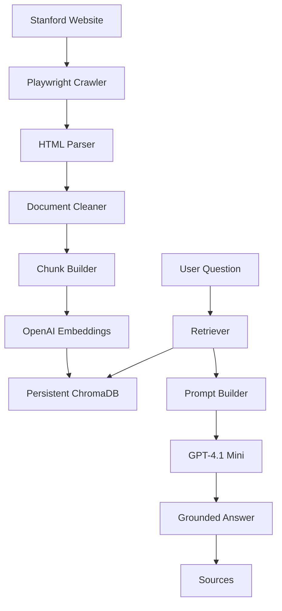

# Stanford AI Website Assistant


> A production-quality AI-powered website support assistant built using Retrieval-Augmented Generation (RAG), LangChain, OpenAI, ChromaDB, and modern AI engineering practices.

---


## Project Overview

The Stanford AI Website Assistant is an intelligent chatbot designed to answer user questions using content crawled from the Stanford University website.

Instead of relying solely on a Large Language Model (LLM), the assistant retrieves relevant website content from a vector database and generates grounded, citation-based responses.

The project emphasizes **production-ready architecture**, modularity, scalability, and maintainability rather than tutorial-style implementation.

---
## Why This Project?

Many AI chatbots simply send user prompts directly to an LLM, often resulting in hallucinations or outdated responses.

This project demonstrates how to build a production-quality Retrieval-Augmented Generation (RAG) system that answers questions using trusted Stanford University website content.

The focus is on applying modern AI engineering practices, including:

- Modular software architecture
- Incremental document ingestion
- Vector search
- Grounded response generation
- Production-ready code organization
- Scalability and maintainability

## Features

- Production-grade website crawler using Playwright
- HTML parsing and content cleaning with BeautifulSoup
- Intelligent document chunking using LangChain
- OpenAI Embeddings (`text-embedding-3-small`)
- Persistent ChromaDB vector database
- Incremental embedding pipeline
- Semantic document retrieval
- Prompt engineering for grounded responses
- GPT-powered question answering
- Source citation support
- Modular and extensible architecture

---

## Project Architecture

```text
                    Stanford Website
                            │
                            ▼
                  Playwright Web Crawler
                            │
                            ▼
                    HTML Content Parser
                            │
                            ▼
                   Document Cleaning
                            │
                            ▼
                 Recursive Text Chunking
                            │
                            ▼
                  OpenAI Embeddings
                            │
                            ▼
                Persistent ChromaDB Store
                            │
                            ▼
                      Retriever
                            │
                            ▼
                    Prompt Builder
                            │
                            ▼
                     GPT-4.1 Mini
                            │
                            ▼
              Grounded Answer + Sources
```

---

## Project Structure

```text
stanford-ai-assistant/

├── app/
│   └── cli.py
│
├── common/
│   ├── logger.py
│   └── timer.py
│
├── data/
│   ├── raw/
│   └── processed/
│
├── ingestion/
│   ├── crawler.py
│   ├── parser.py
│   ├── cleaner.py
│   ├── chunker.py
│   ├── embedder.py
│   └── pipeline.py
│
├── rag/
│   ├── retriever.py
│   ├── prompt_builder.py
│   └── chatbot.py
│
├── scripts/
│
├── tests/
│
├── vectorstore/
│
├── config.py
├── requirements.txt
└── README.md
```
## Architecture


---

## Technology Stack

| Category | Technology |
|-----------|------------|
| Language | Python 3.12 |
| LLM | GPT-4.1 Mini |
| Framework | LangChain 1.x |
| Embeddings | OpenAI `text-embedding-3-small` |
| Vector Database | ChromaDB |
| Web Crawling | Playwright |
| HTML Parsing | BeautifulSoup |
| Environment | python-dotenv |

---

## Current Features

### Website Crawling

- Internal Stanford link discovery
- Configurable crawl depth
- Configurable crawl delay
- Timeout handling
- Raw JSON export

### Parsing

- HTML cleaning
- Script removal
- Navigation removal
- Footer/header removal
- Clean text extraction

### Cleaning

- Duplicate removal
- Empty page filtering
- Metadata normalization
- Minimum content filtering

### Chunking

- RecursiveCharacterTextSplitter
- Stable document IDs
- Stable chunk IDs
- Metadata preservation
- Debug JSON export

### Embeddings

- OpenAI Embeddings
- Persistent ChromaDB
- Incremental indexing
- Automatic updates
- Content hash comparison

### Retrieval

- Semantic similarity search
- Top-k retrieval
- Metadata preservation
- Source URL extraction

### Chatbot

- Grounded responses
- Context-only answering
- Hallucination reduction
- Source citations

---

## Installation

Clone the repository:

```bash
git clone https://github.com/<your-username>/stanford-ai-assistant.git
cd stanford-ai-assistant
```

Create a virtual environment:

```bash
python -m venv .venv
```

Activate it:

### Windows

```bash
.venv\Scripts\activate
```

### macOS/Linux

```bash
source .venv/bin/activate
```

Install dependencies:

```bash
pip install -r requirements-dev.txt
```

Create a `.env` file:

```text
OPENAI_API_KEY=your_openai_api_key
```

---

## Running the Pipeline

Build the vector database:

```bash
python -m scripts.build_vectorstore
```

Inspect ChromaDB:

```bash
python -m scripts.inspect_chromadb
```

Test the retriever:

```bash
python -m scripts.test_retriever
```

Test the prompt builder:

```bash
python -m scripts.test_prompt_builder
```

Run the chatbot:

```bash
python -m scripts.test_chatbot
```

Launch the CLI:

```bash
python -m app.cli
```

---
## Current Status

✅ Phase 2 - Conversational AI

Current Features

- Hybrid Search
- Streaming Responses
- Redis Conversation Memory
- Query Rewriting
- Conversation Summarization
- Expandable Citations
- Docker Support

  

✅ Phase 1 - Website Crawling and Indexing
### Sprint 1 — Complete

- Website crawler
- HTML parser
- Content cleaner
- Recursive chunking
- Incremental embedding pipeline
- Persistent ChromaDB
- Semantic retrieval
- Prompt builder
- GPT-powered chatbot

### Sprint 2 — In Progress

- Structured logging
- Performance metrics
- Conversation memory
- FastAPI backend

## Roadmap

### Sprint 1 ✅

- Environment setup
- Website crawler
- Parser
- Cleaner
- Chunk builder
- OpenAI embeddings
- Persistent ChromaDB
- Retriever
- Prompt builder
- Chatbot

### Sprint 2 🚧

- Logging
- Performance metrics
- Conversation memory
- FastAPI backend

### Sprint 3

- Streamlit admin dashboard
- PostgreSQL + pgvector
- Redis memory
- Docker support

### Sprint 4

- LangGraph agents
- Tool routing
- Multi-agent workflows

### Sprint 5

- Guardrails
- Prompt injection detection
- Hallucination checking
- Groundedness verification

### Sprint 6

- RAGAS evaluation
- LangSmith monitoring
- Automated benchmarks

---

## Future Improvements

- Hybrid Search (BM25 + Vector Search)
- Query Rewriting
- Citation Verification
- Multi-turn Conversation Memory
- AI Guardrails
- Fine-tuning
- Monitoring Dashboard
- Kubernetes Deployment

---

## Learning Objectives

This project demonstrates practical experience with:

- Retrieval-Augmented Generation (RAG)
- AI Engineering
- Prompt Engineering
- Vector Databases
- LangChain
- OpenAI APIs
- Production Python
- Information Retrieval
- LLM Application Development

---

## License

This project is intended for educational and portfolio purposes.

Stanford University content remains the property of Stanford University.
