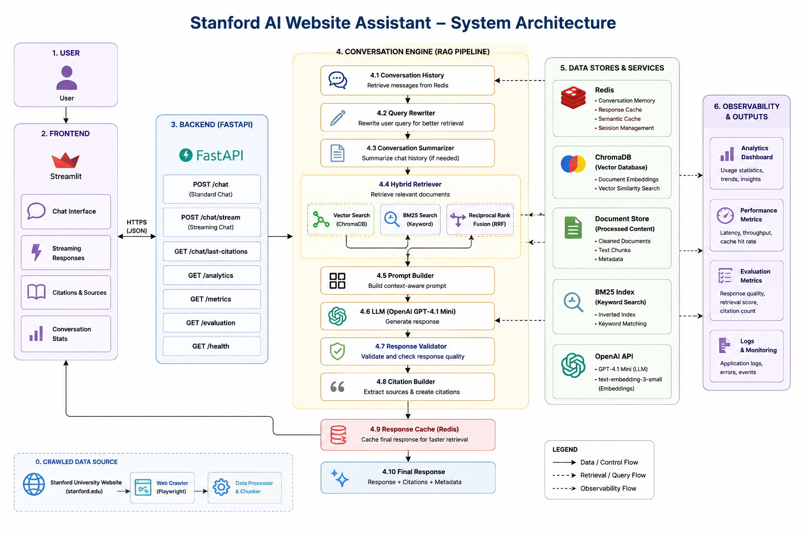
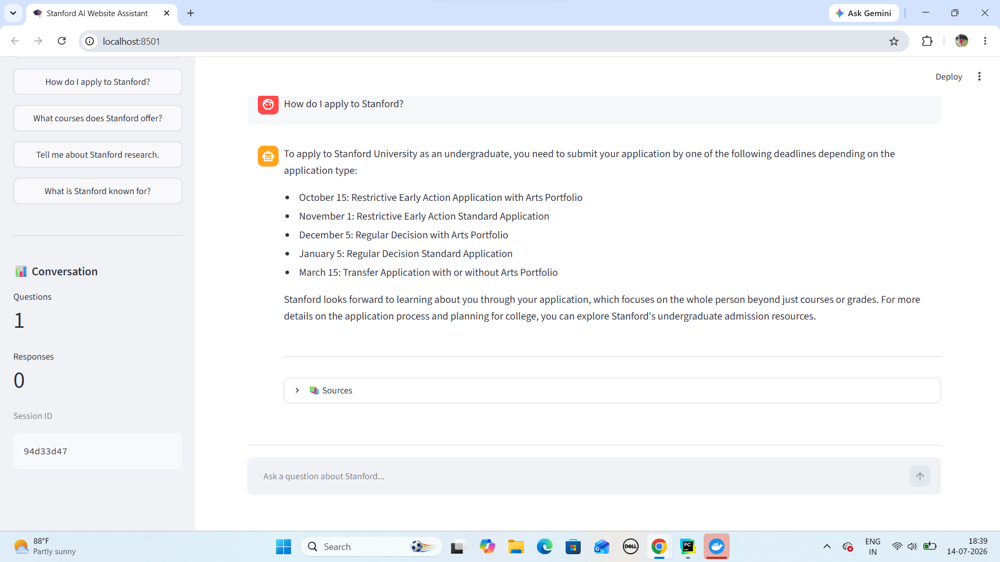
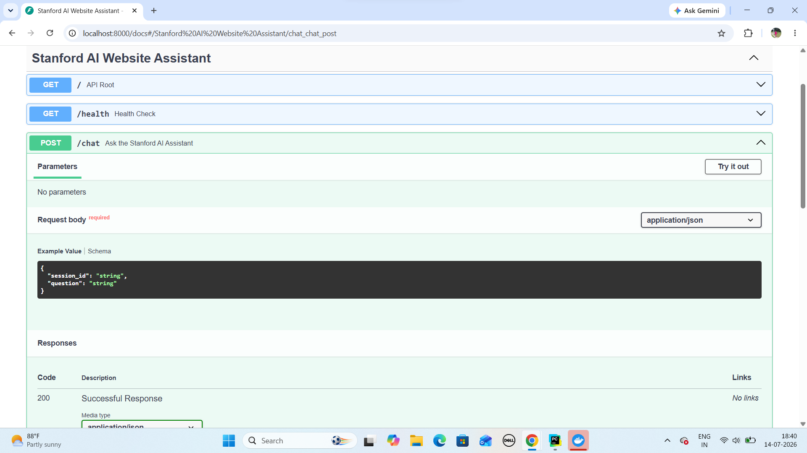
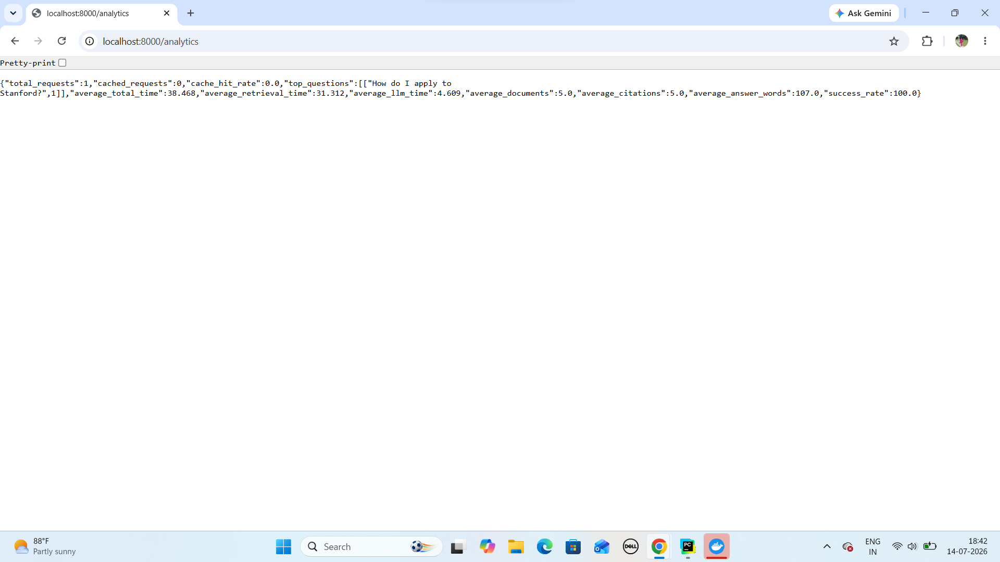

# 🎓 Stanford AI Website Assistant

> A production-inspired Retrieval-Augmented Generation (RAG) assistant that answers questions about Stanford University using Hybrid Search, Conversation Memory, Redis Caching, Guardrails, and OpenAI GPT-4.1 Mini.


---

# 📖 Overview

The **Stanford AI Website Assistant** is a production-inspired conversational AI application that answers questions about Stanford University using a Retrieval-Augmented Generation (RAG) pipeline.

Instead of relying solely on an LLM, the assistant first retrieves relevant information from Stanford webpages before generating responses. This significantly improves factual accuracy, reduces hallucinations, and provides transparent citations for every answer.

The project demonstrates modern AI engineering practices including:

- Hybrid Retrieval
- Conversation Memory
- Query Rewriting
- Response Streaming
- Redis Caching
- Citation Generation
- Guardrails
- Analytics
- Evaluation Metrics
- Docker Deployment

This project was developed as a capstone project while learning Agentic AI Engineering and focuses on building production-quality AI systems rather than simple chatbot demonstrations.

---

# ✨ Features

| Feature | Status |
|----------|:------:|
| Conversational RAG | ✅ |
| Hybrid Retrieval (Vector + BM25 + RRF) | ✅ |
| OpenAI GPT-4.1 Mini | ✅ |
| OpenAI Embeddings | ✅ |
| Conversation Memory | ✅ |
| Query Rewriting | ✅ |
| Conversation Summarization | ✅ |
| Streaming Responses | ✅ |
| Citation Generation | ✅ |
| Response Validation | ✅ |
| Guardrails | ✅ |
| Redis Response Cache | ✅ |
| Semantic Cache | ✅ |
| Analytics Dashboard | ✅ |
| Evaluation Metrics | ✅ |
| FastAPI Backend | ✅ |
| Streamlit Frontend | ✅ |
| Docker Deployment | ✅ |

---

# 🏗 System Architecture



```
                 User
                   │
                   ▼
          Streamlit Frontend
                   │
                   ▼
             FastAPI Backend
                   │
                   ▼
         Conversation Engine
                   │
     ┌─────────────┼──────────────┐
     │             │              │
     ▼             ▼              ▼
Conversation   Guardrails     Analytics
 Memory
     │
     ▼
Query Rewriter
     │
     ▼
Conversation Summary
     │
     ▼
 Hybrid Retriever
     │
 ┌───┴───────────────┐
 ▼                   ▼
Vector Search     BM25 Search
     │                   │
     └──────┬────────────┘
            ▼
 Reciprocal Rank Fusion
            ▼
 Prompt Builder
            ▼
 OpenAI GPT-4.1 Mini
            ▼
 Response Validator
            ▼
 Citation Builder
            ▼
 Redis Cache
            ▼
        Final Response
```

---

# 🛠 Technology Stack

| Layer | Technology |
|--------|------------|
| Backend | FastAPI |
| Frontend | Streamlit |
| LLM | OpenAI GPT-4.1 Mini |
| Embeddings | OpenAI text-embedding-3-small |
| Framework | LangChain |
| Vector Database | ChromaDB |
| Memory & Cache | Redis |
| Web Crawling | Playwright |
| Parsing | BeautifulSoup |
| Containerization | Docker & Docker Compose |
| Language | Python 3.12 |

---

# 📂 Project Structure

```
stanford-ai-assistant
│
├── app
│   ├── api
│   ├── core
│   ├── frontend
│   ├── models
│   ├── rag
│   ├── schemas
│   ├── services
│   ├── dependencies
│   └── main.py
│
├── data
│   ├── raw
│   └── processed
│
├── scripts
├── tests
├── vectorstore
├── Dockerfile
├── docker-compose.yml
├── requirements.txt
└── README.md
```

---

# 🔄 Retrieval Pipeline

The assistant follows a multi-stage conversational RAG workflow:

1. User submits a question.
2. Conversation history is retrieved.
3. Query is rewritten for improved retrieval.
4. Conversation summary is generated (when required).
5. Hybrid retrieval performs:
   - Vector Search
   - BM25 Search
   - Reciprocal Rank Fusion
6. Prompt is constructed.
7. GPT-4.1 Mini generates a response.
8. Response Validator checks the generated answer.
9. Citations are generated.
10. Response is cached.
11. Analytics and evaluation metrics are recorded.

---

# 🚀 Installation

Clone the repository

```bash
git clone https://github.com/ShraddhaBaid104/stanford-ai-website-assistant.git

cd stanford-ai-website-assistant
```

Install dependencies

```bash
pip install -r requirements.txt
```

Create a `.env` file

```env
OPENAI_API_KEY=your_openai_api_key

REDIS_HOST=redis

REDIS_PORT=6379
```

---

# 🐳 Running with Docker

Build and start the application

```bash
docker compose up --build
```

Backend

```
http://localhost:8000
```

Swagger Documentation

```
http://localhost:8000/docs
```

Health Check

```
http://localhost:8000/health
```

---

<<<<<<< HEAD
✅ Phase 2 - Conversational AI

Current Features

- Hybrid Search
- Streaming Responses
- Redis Conversation Memory
- Query Rewriting
- Conversation Summarization
- Expandable Citations
- Docker Support

  

✅ Phase 1 - Website Crawling and Indexing
### Sprint 1 — Complete
=======
# 💻 Running the Streamlit Frontend
>>>>>>> b86f4b8 (Release v1.0.0: Production Stanford AI Website Assistant)

```bash
cd app/frontend

streamlit run app.py
```

The Streamlit application will be available at

```
http://localhost:8501
```

---

# 📡 API Endpoints

| Method | Endpoint | Description |
|---------|----------|-------------|
| GET | / | Root endpoint |
| GET | /health | Health status |
| POST | /chat | Standard chat |
| POST | /chat/stream | Streaming chat |
| GET | /chat/last-citations | Retrieve citations |
| GET | /analytics | Analytics summary |
| GET | /metrics | Performance metrics |
| GET | /evaluation | Evaluation statistics |

---

# 💬 Example Questions

- What is Stanford University known for?
- How do I apply to Stanford?
- Tell me about Stanford research.
- What financial aid options are available?
- What undergraduate programs are offered?
- What are Stanford's admission requirements?
- Tell me about Stanford's history.

---

# 📊 Evaluation

The assistant records runtime metrics for every request, including:

- Retrieval latency
- LLM generation time
- Total response time
- Retrieved document count
- Citation count
- Average retrieval score
- Best retrieval score
- Cache hits
- Response statistics

These metrics can be used to monitor and improve system performance.

---

# 📸 Screenshots

## Streamlit Frontend



---

## FastAPI Swagger Documentation


---

## Analytics Dashboard

> 
---

# 🎯 Future Improvements

- PostgreSQL + pgvector
- Multi-user authentication
- Admin dashboard
- User feedback collection
- Observability using Prometheus & Grafana
- Kubernetes deployment
- Multi-website support
- Continuous evaluation pipeline

---

# 📚 Lessons Learned

This project provided hands-on experience with:

- Production-oriented RAG architectures
- Hybrid retrieval techniques
- LangChain orchestration
- Redis caching strategies
- Prompt engineering
- FastAPI backend development
- Docker containerization
- Building explainable AI systems with citations
- Designing modular AI applications

---

# 👩‍💻 Author

**Shraddha Nahata**

MBA (Finance) | B.Sc. (Economics)

Agentic AI Engineer | AI Educator

GitHub:

https://github.com/ShraddhaBaid104


---

# 📄 License

This project is licensed under the MIT License.

<<<<<<< HEAD
Stanford University content remains the property of Stanford University.
=======
---

# ⭐ If you found this project useful, consider giving it a star!
>>>>>>> b86f4b8 (Release v1.0.0: Production Stanford AI Website Assistant)
